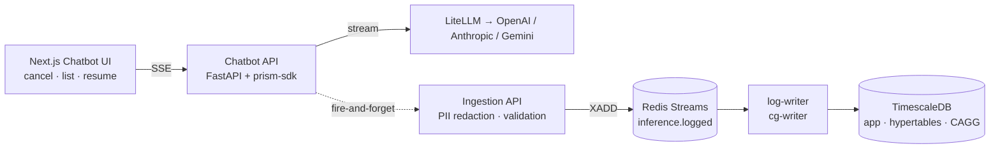

# Prism

A lightweight inference logging + chat system: a Next.js chatbot, a Python SDK that wraps LLM calls, an event-driven ingestion pipeline, and dashboards.

---

## Setup

One command from a fresh clone:

```bash
make up
```

That runs `scripts/bootstrap_env.py` (copies `.env.example` → `.env`, generates `REDIS_PASSWORD` and `PRISM_CREDS_KEY`) and then `docker compose up -d --build`. Provider API keys are added through the in-app **Settings** UI — no env-var editing required.

| Surface | URL |
|---|---|
| Chatbot UI | http://localhost:3001 |
| Metrics dashboard | http://localhost:3001/metrics |
| Chatbot API docs | http://localhost:8100/docs |
| Ingestion API docs | http://localhost:8101/docs |

Other useful targets: `make down`, `make logs`, `make psql`, `make check` (lint + typecheck + tests).

---

## Capabilities

Everything in the assignment's bonus list:

| Bonus | Where it lives |
|---|---|
| Multi-provider support | OpenAI / Anthropic / Gemini via LiteLLM (`sdk/`) — picker on every chat turn |
| Streaming responses | SSE end-to-end; tokens stream through chatbot-api into the UI |
| Latency + throughput + error dashboards | `/metrics` page reads `metrics_minute` rollups; configurable dashboards under `/dashboards` |
| Docker Compose one-command setup | `make up` |
| Event-based architecture | Redis Streams (`inference.logged`) with consumer group + TimescaleDB continuous aggregate |
| PII redaction | At the ingestion trust boundary, before anything hits the bus |
| Self-hosted k8s deploy | Stateless services + named-volume datastores — compose maps 1:1 to Deployments + StatefulSets; HPA-friendly. The Helm chart is the only piece not in the repo (see _Future improvements_). |
| Frontend | Next.js app with **cancel** (in-flight `AbortController` → server `cancelled` status), **list conversations** (sidebar), and **resume conversation** (clicking any item rehydrates message history and continues streaming) |

---

## Architecture overview

Five processes plus the UI. Chat traffic and observability traffic share no synchronous path — the SDK is fire-and-forget over HTTP, and the only place the two meet is a soft FK column.



- **Chatbot API** is the only thing that talks to LiteLLM; the SDK is in-process inside it.
- **Ingestion API** is the trust boundary — PII redaction and validation happen here, before publish. Nothing past the bus ever sees an unredacted prompt or raw payload.
- **One consumer group** (`cg-writer`) reads the stream and inserts into the hypertable. Metrics aggregation is handled by a TimescaleDB continuous aggregate — no separate consumer needed. Adding a new consumer (cost calculator, deep PII scan, eval sampler) is a deployment change, not a writer change.
- **metrics_minute** is a TimescaleDB continuous aggregate that auto-refreshes every 5 minutes with real-time merge for recent data. Percentile queries run directly against the raw hypertable.

More detail in [`docs/architecture.md`](docs/architecture.md).

---

## Schema design decisions

The whole schema is organized around one invariant: **app data and observability data must never join on the write path.**

| Group | Tables | Workload | Today | Tomorrow |
|---|---|---|---|---|
| A. App data | `conversations`, `messages`, `provider_credentials` | OLTP, mutable, low volume | Postgres | Postgres (unchanged) |
| B. Inference logs | `inference_logs`, `tool_invocations` (TimescaleDB hypertables, 1-day chunks) | OLAP, append-only, high volume | TimescaleDB | ClickHouse + S3 for raw payloads |
| C. Rollups | `metrics_minute` (continuous aggregate) | Read-optimized, auto-refreshed | TimescaleDB | ClickHouse materialized view |

Concrete decisions and why:

- **No FKs across groups.** `inference_logs.message_id` is a soft reference. Any group can move to a different store without unwinding constraints, and deleting an app-side conversation does not nuke audit history.
- **TimescaleDB hypertables.** `inference_logs` is a hypertable with 1-day chunks; PK is `(id, created_at)` because TimescaleDB (like Postgres partitioning) requires the time dimension in every unique index. Retention (30d) and compression (7d) are managed by TimescaleDB policies.
- **`raw_payload_uri` exists on day one** alongside `raw_payload_jsonb`. Writes go to jsonb today; readers check `if uri: fetch_from(uri) else: read_jsonb`. The S3 switch is a write-path change with zero reader churn.
- **Three timestamps per log row.** `ts_start`/`ts_end` come from the SDK (authoritative for latency, subject to client clock skew); `created_at` is set by the ingestion API and is what we partition + dashboard on (consistent server clock).
- **Pre-aggregated metrics via continuous aggregate.** `metrics_minute` is a TimescaleDB continuous aggregate that materializes additive metrics (counts, sums, costs) per minute bucket, auto-refreshed every 5 minutes. With `materialized_only = false`, queries merge materialized data with recent raw rows for real-time results. Percentile queries (which can't be pre-aggregated without lying) run directly against the raw hypertable via `percentile_cont`.
- **Storage interfaces, not direct drivers.** All log access goes through `LogStore` / `RawPayloadStore` / `Bus` interfaces. No `psycopg`/`redis-py`/`boto3` imports outside `infra/storage/` and `infra/bus/`. The interfaces buy "no caller refactor" on migration — they don't paper over real query-semantic differences (PG `ON CONFLICT` → ClickHouse `ReplacingMergeTree`'s eventual dedupe; exact `percentile_cont` → approximate `quantile()`; Redis Streams' `XCLAIM` → Kafka offsets). The cutover is a design exercise, not a DI swap.
- **Provider credentials encrypted at rest.** Fernet over a stable `PRISM_CREDS_KEY`; API responses never include decrypted secrets; no browser `localStorage`.

---

## Tradeoffs and future improvements

Everything below is a known limit we shipped on purpose — with the mitigation that's already in the code and the next step we'd take.

| Area | What we accept today | Why it's fine here | What we'd do next |
|---|---|---|---|
| **Single TimescaleDB for app + logs + rollups** | One DB is a SPOF | Demo scale; interfaces hide the storage | Split logs → ClickHouse, raw payloads → S3 via the existing `LogStore` swap |
| **SDK is fire-and-forget, no on-disk spool** | Bounded queue + `atexit` flush; `kill -9` loses ≤200ms of events | Logs are observability, not source of truth; never block user latency | Local disk spool + replay-on-restart |
| **PII regex** (email/phone/SSN/credit-card) | Misses non-standard formats | Better than nothing; failure is bounded and visible | Plug Microsoft Presidio behind the same `Redactor` interface (`PRISM_REDACTOR=presidio`) |
| **Redis Streams capped with `MAXLEN ~ 1_000_000`** | During a long worker outage Redis silently trims | Bounded memory > unbounded backlog at demo scale | Pair with object spool / Kafka via the `Bus` interface; expose trim count as a metric. Note: Redis Cluster does *not* automatically scale one logical stream — sharding `inference.logged.{0..N}` by key is the prerequisite, not a free win |
| **CAGG refresh lag** | Materialized data can be up to 5 min stale | `materialized_only = false` merges with raw data transparently | Tighten refresh interval if sub-minute materialized freshness is needed |
| **Streaming logs once at completion**, not per-token | No mid-stream stall detection, no inter-token throughput, no partial-output debug on cancels | Per-token logging would 100× event volume; TTFT + total latency cover the perceived-UX signal | Sampled per-token capture as a *new* event type + table (not an extension of `inference_logs`) |
| **`PRISM_KEEP_RAW=true`** persists redacted raw payloads in jsonb | TOAST compression handles it at demo scale | The `raw_payload_uri` column is already wired | Flip writes to S3, keep `raw_payload_jsonb` NULL |
| **Shallow healthchecks** | `/healthz` returns `ok` without probing deps | OK for demo | Expose `XPENDING`/lag, dropped-event counters, ingestion-rejection alarms, SLO tracking |
| **Tracing** | Structured logs only | Sufficient to debug the demo | OpenTelemetry across SDK → ingestion → worker → DB, correlated by `inference_id` |

See [`docs/architecture.md`](docs/architecture.md) for ingestion flow, logging strategy, scaling considerations, and failure handling assumptions.
